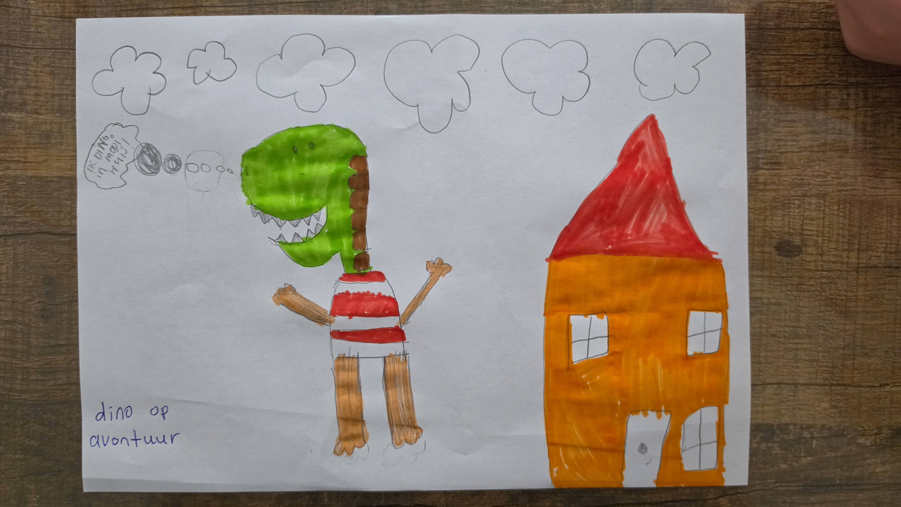

# 🦕 Dino op Avontuur

> **Bedacht & getekend door Dex (6 jaar)** — *"ik dino in mooi huis!"*

Dino is op avontuur, maar hij heeft nog geen huis. Help Dino in 4 levels alle
onderdelen te verzamelen — houten balken, oranje stenen, ramen, de deur en
dakpannen — en bouw samen het mooie huis van Dex' tekening!

## Spelen

Open `index.html` in een browser. Dat is alles — het hele spel zit in één
bestand, inclusief muziek en geluidjes (die maakt het spel zelf).

| Actie | Toetsen | Tablet / telefoon |
|-------|---------|-------------------|
| Lopen | ← → of A / D | Knoppen ◀ ▶ |
| Springen | Spatie, ↑ of W | Knop ⬆ |
| Muziek aan/uit | M | Knopje 🎵 |

Geen game-over, niks engs: prikstruiken en slakken duwen je alleen zachtjes
terug, en paddenstoelen zijn trampolines. Gemaakt voor spelers vanaf ± 5 jaar.

Lees [GAMEPLAN.md](GAMEPLAN.md) voor het hele plan: de levels, de muziek per
level, alle geluidseffecten en het verhaal.

## Credits

- ⭐ **Dex (6 jaar)** — bedenker, tekenaar en baas van het spel
- **Claude** — programmeerwerk
